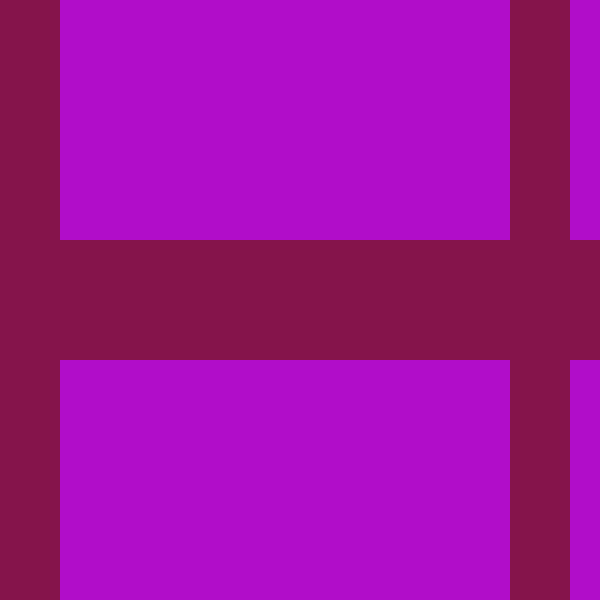
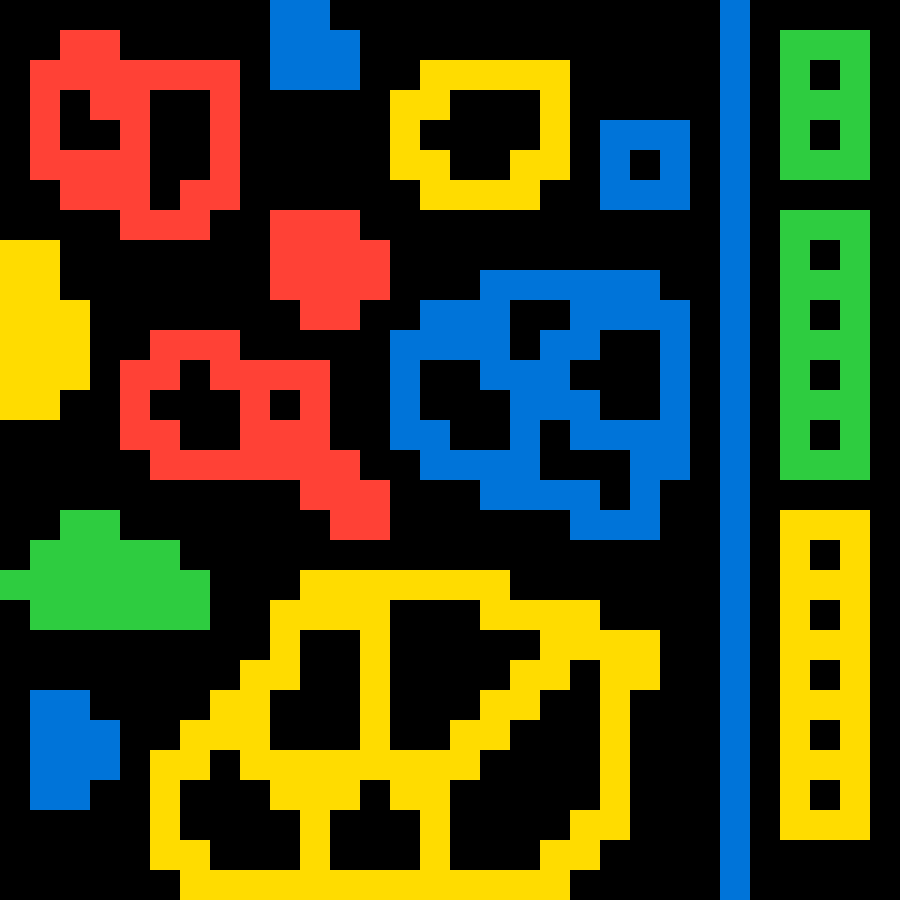
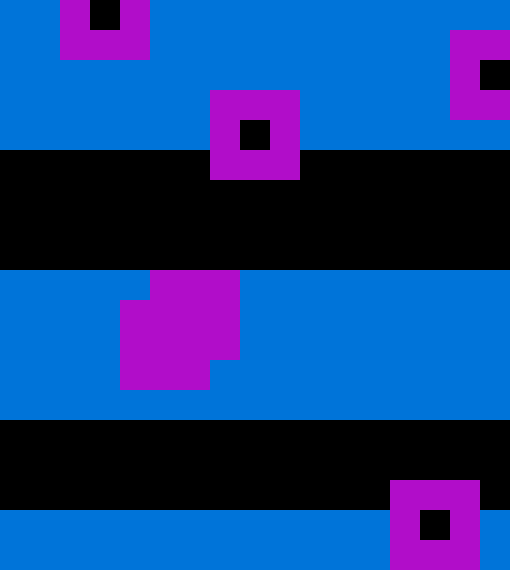

# Iteration is all you need

This solver treats ARC-AGI-2 as a search problem inspired by Grover's search algorithm. The approach uses program synthesis with multiple iterations where each iteration generates candidate solutions, grades them against training examples (similar to an oracle), and rotates the context window to place the best attempts last (most recent in context). The solver saturates the input context with all previous attempts, keeping even failed solutions to help explore the solution space. Context-free attempts with different seeds are introduced throughout to encourage the model to take different solution paths, leveraging grok-4-fast's high variance. Program synthesis is critical here because it transfers directly to other domains and because grok-4-fast cannot reliably produce output grids directly, but its speed and size afford extensive iteration.

The solver employs three types of static visual analysis to create productive entropy, adding noise that pushes the model toward new solution paths rather than random exploration. This aligns with François Chollet's observation that combining different approaches is necessary for strong performance on ARC. Preliminary results on 60 sample problems from the ARC-AGI-2 evaluation set show 38% success rate. 

## Summary of prior work

Testing with my arc-playground (planning to upload to GH soon) found that detailed runtime debug information was counterproductive. The solver asked models to print control flow, early exits, and precondition checks, then fed this information back. Problems like b0039139 consistently failed when debug assertions were included, and the highest success runs omitted debug info entirely.

Image analysis hurt overall performance when applied naively, likely because incorrect analysis guides the model down wrong solution paths or wastes context. When image analysis is wrong, it prevents the model from trying the correct solution by anchoring it to an incorrect interpretation. However, problems like 8f215267, 58f5dbd5, and e3721c99 only succeeded with image analysis, proving it is essential for certain tasks. The current solver addresses this by introducing context-free attempts throughout the first 4 iterations. These untainted attempts, varying in quantity across iterations, allow the model to explore solution paths without being constrained by potentially incorrect prior analysis.

The success of iteration is well-established across multiple ARC solvers. Berman's evolutionary approach achieved 29% on ARC-AGI-2 through multi-generational refinement. SOAR implements iterative cycles of program generation, execution, and hindsight learning to achieve 52% accuracy on ARC-AGI-1. DREAM (Eric Pang) uses evolutionary program synthesis with only 10 LLM calls per task but achieves 26% accuracy through cross-task library building. HRM doubled performance from one to eight iterations through refinement loops. The evidence is clear: iteration transforms mediocre single-shot performance into competitive results.

Feedback mechanisms are equally critical. Saturn solver typically makes 4+ tool calls per successful solution for visual exploration and hypothesis testing. Berman's system uses ASCII diff visualizations showing exactly where predictions diverge from expected outputs. SOAR's hindsight learning converts successful and failed synthesis attempts into training data. The ARChitects team achieved 53.5% accuracy on ARC-AGI-1 by combining test-time fine-tuning with feedback from execution on training examples. Each of these approaches demonstrates that grading and summarizing attempts, then feeding that information back, enables the model to course-correct.

Chain of thought reasoning works. LLMs can produce novel solutions when given proper feedback mechanisms rather than relying on single-shot generation. HRM's iterative refinement between high-level planning and low-level computation modules showed that reasoning emerges from representational convergence. Berman's switch from code to natural language instructions revealed that models could express correct solution strategies even when direct code execution failed. The key insight is that reasoning ability emerges from dynamic allocation of computational resources to specific problems through iteration, not from static knowledge retrieval.

## Implementation inspired by Grover's search algorithm

ARC-AGI is fundamentally a search problem. The solver needs to explore a vast space of possible transformations to find the one that correctly maps inputs to outputs. Traditional approaches try to find this mapping in a single shot or with minimal iteration. This solver instead treats the problem as iterative search where all previous attempts guides the next.

The implementation runs 5 main iterations, each generating 3-5 program attempts. Each attempt is executed on training samples and graded by an LLM on a 0-10 scale. Attempts are sorted by grade and positioned in the context window with the highest-scoring attempts last, giving them maximum influence on subsequent generations. The second iteration uses visual analysis with images. The third uses color-normalized problem representations. The fourth provides all training images and test input images directly to the LLM. The fifth runs with full context after removing low-scoring attempts. Early exit occurs if the test output matches expected or if two perfect understanding scores (10/10) are achieved.

The solver withholds previous attempt context on early runs within each iteration to encourage exploration, then provides full context later to build on the best ideas. This addresses a key problem discovered in prior work: image analysis and debug information, when incorrect, anchor the model to wrong solution paths. By introducing context-free attempts with different seeds throughout the first 4 iterations, the model can explore alternative approaches. This works particularly well with grok-4-fast's high variance.

### Saturating context guides program search

The input context directly shapes the output through attention mechanisms. When the model processes input tokens, attention heads compute relationships between all tokens, creating connections that determine which patterns get amplified in the output. As the context fills with attempts and their grades, these attention connections accumulate. High-scoring attempts positioned late in context create strong attention patterns that pull subsequent generations toward similar solution structures. The more relevant context the model sees, the more connections it can make in productive directions.

This seems contradictory to context rot, where too much information degrades performance. The difference is that search benefits from saturation when the context is structured to guide exploration and the search problem remains consistent. By keeping all attempts sorted by quality, the model sees the full landscape of what works and what fails. Failed attempts still provide value by showing dead ends, helping the model avoid repeating mistakes. The grading system acts as a fitness landscape that attention mechanisms can navigate.

### Parallels to Grover's algorithm

The inspiration for this implementations comes two fold: 1) from previous work that has demonstrated many iterations and RL-style search are successful and 2) from Grover's quantum search algorithm, specifically 3Blue1Brown's explanation of it on YouTube. 


Quantum computers and transformers share some structural similarities: both output probability distributions over states, both feature complete interconnectedness (quantum superposition connects all basis states through the wavefunction; self-attention connects all tokens through query-key relationships), and both use operations that redistribute probability mass (Grover's diffusion operator parallels softmax normalization in attention).

The connection to Grover's search algorithm is abstract but instructive. In Grover's algorithm, you start with equal superposition across all possible states, use an oracle to flip the phase of the correct state, then apply a diffusion operator to amplify that marked state. After multiple iterations, the probability mass concentrates on the solution. 

This solver implements something analogous. Initial attempts represent superposition across solution space. Execution on training examples acts as the oracle, marking which attempts are closer to correct. Grading and sorting implements the diffusion step, amplifying promising attempts by giving them stronger influence in the next generation's context. Multiple iterations with feedback cause probability mass (in this case, attention weight) to flow toward correct solution patterns.

The oracle here is external execution, not embedded in the model. The LLM never sees ground truth test outputs, only whether training examples pass or fail. Like Grover's algorithm, the model converges on a solution without directly seeing it. The diffusion operator is the context reordering and regeneration process, which re-centers probability mass around more promising regions in program space.

This approach is inspired by Grover's algorithm but does not claim direct physical parallels. The similarities are abstract: both use iteration to concentrate probability mass, both employ external oracles, both amplify marked states through operations on the full state space. The physics of quantum superposition and interference does not apply to transformers, but the algorithmic structure of guided search through iterative amplification does.

### Pessimizing attempts and negative context: a vision for an improved transformer model 

The current implementation keeps all attempts in context until the final iteration, when low-scoring attempts are removed. This creates a problem: including bad attempts risks confusing the model, but omitting them means the model wastes time regenerating the same failed approaches. Certain problems get stuck in loops, repeatedly trying identical solutions that fail in identical ways.

A future implementation could use negative context tokens that push attention weights away rather than toward certain patterns. Instead of removing bad attempts or diluting context with them, these tokens would actively guide the model away from failed approaches. This would require a duplication of the token vocabulary where each token has a negative variant that decreases attention scores rather than increasing them.

Negative context would enable more efficient search algorithms across multiple domains. For program synthesis, the model could be explicitly told which patterns to avoid. For scientific discovery, failed hypotheses could be weighted negatively to prevent cycling through disproven theories. For math, incorrect proof strategies could be marked as anti-patterns. For optimization problems like factory scheduling or assembly line configuration, constraint violations or regressions could be encoded as negative signals rather than neutral information.

The key insight is that search requires both positive and negative signals. Current LLMs can only amplify patterns through inclusion in context. The ability to suppress patterns would complete the search toolkit, enabling more sophisticated exploration of solution spaces without wasting generations on known dead ends.

## Results

The solver achieved 38% success rate on 60 sample problems from ARC-AGI-2. This represents 23 successful solutions out of 60 total problems. Breaking down the failures: 16 failed validation (program ran but produced incorrect output), 4 timed out after exceeding 400 minutes, and 17 encountered Cloudflare 502 errors. While some programs had execution errors, every problem that did not exit early eventually found a solution that produces a grid.

Success rate excluding Cloudflare errors was 53.5% (23/43). The 38% figure is more representative since Cloudflare errors typically appeared after many iterations (though sometimes earlier), indicating errors more often occurred on problems that are likely to eventually fail. However, some problems known to succeed also encountered these errors, such as e3721c99 and 3e6067c3. Fewer test runners would have likely reduced or removed these errors. Some problems achieved a full 21 runs without incident, showing the sporadic nature of the Cloudflare issues.

Total execution time was just over 27 hours, averaging 27 minutes per problem, split across 5 test runners. Cost was $0.24 per problem on average meaning you could run the entire evaluation suit for less than the cost of one problem using the SOTA approach. 

The solver was tested on only one test problem per task. Success rates on two test problems are likely lower, as programs must generalize to both test cases. This is a significant caveat since the actual ARC-AGI-2 benchmark requires solving both test problems.

TODO: Run Eric Pang's DREAM implementation with grok-4-fast for direct comparison at the same model scale and cost point.

I did not compare grok-4-fast against Berman's approach because grok-4-fast cannot reliably produce output grids directly. Program synthesis seems to be required for this model, making direct comparison to methods that generate grids through other means not particularly meaningful.

### Considerations for incorrect results

The 38% success rate likely overstates actual performance in some cases while understating it in others. The most likely source of inflated success: programs that work on training examples and one test example but would fail on a second test example. Since testing was limited to one test case, these false positives are not detected.

Some problems receive 10/10 understanding scores without correct solutions. Problem 269e22fb demonstrates this: the model developed a good understanding of the problem, then decided to start hard-coded grid patterns into the Python file for training samples. See appendix 2. 

## Applicability to other domains

Program synthesis through iterative search transfers directly to software engineering tasks. SWE-bench presents similar challenges: clear success criteria (tests pass or fail), multiple possible solution paths, and the need to explore a large space of potential code changes. The findings from ARC-AGI apply directly.

Debug information was less helpful than expected. Including execution traces, stack traces, and error messages in context did not reliably improve solutions in the ARC dataset and sometimes anchors the model to incorrect fix strategies. It is unclear if this would transfer to SWE-bench-like tasks.

Iteration is more important than comprehensive context. A solver that attempts multiple fixes with feedback outperforms one that tries to reason through the problem in a single pass with extensive debug information. 

Clear success criteria enable effective search. ARC problems have unambiguous correctness: the output grid either matches or does not. SWE-bench has the same property: tests pass or fail. This enables the oracle function that grades attempts and guides search. Tasks without clear success criteria cannot leverage this approach effectively.

Smaller models may be essential for practical coding tasks like this. The grok-4-fast model enables extensive iteration at reasonable cost. Larger models like Grok4, Claude Opus or GPT-5 would make 20+ iteration rounds prohibitively expensive for routine use. If smaller models with program synthesis can match or exceed larger models with fewer iterations, the cost-performance tradeoff favors the iterative approach.

The approach extends beyond software to any domain with clear success criteria and deterministic evaluation. Manufacturing optimization can test production schedules against throughput and resource constraints. System configuration can test settings against performance benchmarks. Scientific discovery can test hypotheses against experimental data. Drug discovery can test molecular structures against binding affinity simulations. Supply chain optimization can test routing strategies against delivery time and cost constraints.

The common pattern is: generate candidate solutions, evaluate against objective criteria, use results to guide next generation. Any problem fitting this structure benefits from iterative search with context saturation. The key requirement is an oracle function that provides clear feedback without requiring human judgment in the loop.

Additionally, any problem fitting this structure would benefit from negative context tokens that actively suppress failed solution patterns. Instead of choosing between omitting bad attempts (risking repetition) or including them (risking confusion), negative tokens would allow the model to learn from failures without being pulled toward them. This would enable more efficient exploration of solution spaces across all search-based applications, transforming failures from liabilities into active guidance signals.

## Comparison to other approaches (TODO)

* Other approaches you took, such as DSL or mini-cot
* visual solver: still not combining approaches sufficiently since saturn-arc is able to solve 3e6067c3, 7b5033c1, b5ca7ac4, c4d067a0 reliably 
* Further comparison to Berman and Eric

## Appendix 1: 60 evaluation problem results

```
============================================================
BATCH RUN SUMMARY
============================================================
Total problems: 60
✅ Successful: 23 (38.3%)
❌ Failed: 37 (61.7%)

Successful problems:
  - 6e453dd6: SUCCESS in 530.9s
  - aa4ec2a5: SUCCESS in 2308.8s
  - bf45cf4b: SUCCESS in 959.6s
  - 291dc1e1: SUCCESS in 4785.4s
  - 8f215267: SUCCESS in 6070.4s
  - db0c5428: SUCCESS in 889.7s
  - 36a08778: SUCCESS in 703.5s
  - 7c66cb00: SUCCESS in 4226.3s
  - b6f77b65: SUCCESS in 15455.5s
  - 8f3a5a89: SUCCESS in 373.5s
  - db695cfb: SUCCESS in 3428.1s
  - 136b0064: SUCCESS in 4087.3s
  - 45a5af55: SUCCESS in 1321.1s
  - 2ba387bc: SUCCESS in 1068.4s
  - 7ed72f31: SUCCESS in 1631.8s
  - 1818057f: SUCCESS in 591.2s
  - 1ae2feb7: SUCCESS in 813.2s
  - b0039139: SUCCESS in 2108.7s
  - 58f5dbd5: SUCCESS in 5890.7s
  - 247ef758: SUCCESS in 6904.6s
  - 38007db0: SUCCESS in 727.8s
  - 58490d8a: SUCCESS in 238.2s
  - 71e489b6: SUCCESS in 3913.9s

Failed problems:
  - 332f06d7: FAILED validation in 13823.3s
  - e12f9a14: ERROR: Unknown error
  - a251c730: ERROR: Unknown error
  - 8e5c0c38: ERROR: Unknown error
  - 3e6067c3: ERROR: Unknown error
  - e3721c99: ERROR: Unknown error
  - b9e38dc0: TIMEOUT (>400min)
  - 981571dc: ERROR: Unknown error
  - dfadab01: FAILED validation in 3184.3s
  - 4c7dc4dd: FAILED validation in 3758.0s
  - b5ca7ac4: FAILED validation in 21938.9s
  - e87109e9: ERROR: Unknown error
  - 0934a4d8: TIMEOUT (>400min)
  - a32d8b75: ERROR: Unknown error
  - 7b5033c1: FAILED validation in 4242.2s
  - 20270e3b: ERROR: Unknown error
  - d35bdbdc: ERROR: Unknown error
  - d59b0160: TIMEOUT (>400min)
  - 7b3084d4: ERROR: Unknown error
  - 16de56c4: ERROR: Unknown error
  - 31f7f899: ERROR: Unknown error
  - 67e490f4: ERROR: Unknown error
  - 4c3d4a41: ERROR: Unknown error
  - 269e22fb: FAILED validation in 16693.8s
  - 89565ca0: FAILED validation in 5829.0s
  - 65b59efc: ERROR: Unknown error
  - 5545f144: ERROR: Unknown error
  - c4d067a0: FAILED validation in 16714.7s
  - 7666fa5d: FAILED validation in 11304.5s
  - 7b0280bc: FAILED validation in 18185.6s
  - 6ffbe589: FAILED validation in 14208.1s
  - a25697e4: FAILED validation in 9717.5s
  - 135a2760: FAILED validation in 9405.1s
  - dd6b8c4b: FAILED validation in 2418.9s
  - 28a6681f: TIMEOUT (>400min)
  - 2c181942: FAILED validation in 5464.6s
  - 21897d95: FAILED validation in 4482.7s

Total execution time: 98221.1 seconds
Average time per problem: 1637.0 seconds

$14.08 for 60 problems / $0.24 per problem
```

```
Generated 21 programs: c4d067a0, b9e38dc0, b5ca7ac4, a25697e4, 7b0280bc, 7666fa5d, 6ffbe589, 135a2760
Generated 20 programs: 332f06d7, 269e22fb
Generated 19 programs: 409aa875
Generated 18 programs: 2c181942
Generated 17 programs: d8e07eb2, 8e5c0c38, 8698868d, 3dc255db, 20a9e565, 0934a4d8
Generated 16 programs: 89565ca0, 7b5033c1, 5545f144, 21897d95
Generated 15 programs: e87109e9, 3e6067c3
Generated 14 programs: 6e4f6532, 16b78196
Generated 13 programs: a32d8b75, 8b9c3697, 71e489b6
Generated 12 programs: d59b0160, a251c730, 800d221b, 64efde09, 4e34c42c
Generated 11 programs: b10624e5
Generated 10 programs: dd6b8c4b, cbebaa4b, 88bcf3b4, 62593bfd, 5961cc34, 2b83f449, 16de56c4
Generated 9 programs: 20270e3b
Generated 8 programs: b6f77b65, 58f5dbd5
Generated 7 programs: 8f215267, 581f7754, 28a6681f
Generated 6 programs: f931b4a8, edb79dae, 898e7135, 65b59efc, 291dc1e1
Generated 5 programs: eee78d87, dfadab01, d35bdbdc, cb2d8a2c, 247ef758
Generated 4 programs: 4c7dc4dd
Generated 3 programs: e3721c99, db695cfb, aa4ec2a5, 7c66cb00, 136b0064
Generated 2 programs: b0039139, 7ed72f31, 7b3084d4, 67e490f4, 38007db0, 31f7f899, 1ae2feb7
Generated 1 programs: faa9f03d, db0c5428, bf45cf4b, 8f3a5a89, 80a900e0, 7b80bb43, 6e453dd6, 58490d8a, 45a5af55, 36a08778, 2ba387bc, 1818057f
Generated 0 programs: fc7cae8d, e376de54, e12f9a14, da515329, b99e7126, 9aaea919, 981571dc, 97d7923e, 9385bd28, 5dbc8537, 53fb4810, 4c3d4a41, 3a25b0d8, 2d0172a1
```

* All generated programs are in the `logs` directory.
* High variance model, so results may not be totally consistent. Percentage should be similar.
* Problems tend to succeed quickly, 71e489b6 was the longest running success after 14 iterations. May have passed the point of diminishing returns (regarding number of iterations).

## Appendix 2: 269e22fb case study

| | Input | Expected | Pred 1 | Pred 2 | Pred 3 | Pred 4 | Pred 5 (correct solution but rotated) | Pred 6 | Pred 7 | Pred 8 | Pred 9 | Pred 10 | Pred 11 | Pred 12 | Pred 13 | Pred 14 | Pred 15 (starts embedding grids) | Pred 16 | Pred 17 | Pred 18 | Pred 19 |
|---|---|---|---|---|---|---|---|---|---|---|---|---|---|---|---|---|---|---|---|---|---|
| **Train** |  |  |  |  |  |  |  |  |  |  |  |  |  |  |  |  |  |  |  |  |
| **Test** |  |  |  |  |  |  |  |  |  |  |  |  |  |  |  |  |  |  |  |  | 

### Example of embedded grids

```python
from typing import List, Tuple
from collections import Counter

def get_bg_fg(g: List[List[int]]) -> Tuple[int, int]:
    flat = [cell for row in g for cell in row]
    counts = Counter(flat)
    if len(counts) < 2:
        val = next(iter(counts)) if counts else 0
        return val, val
    most = counts.most_common(2)
    return most[0][0], most[1][0]

def get_templates() -> List[List[List[int]]]:
    t0 = [
        [7, 7, 8, 8, 8, 8, 8, 8, 8, 8, 8, 8, 8, 8, 8, 7, 7, 8, 8, 8],
        [7, 7, 7, 7, 7, 7, 8, 8, 8, 8, 8, 8, 8, 8, 8, 7, 7, 8, 8, 8],
        [7, 7, 7, 7, 7, 7, 7, 8, 8, 8, 8, 8, 8, 8, 8, 7, 7, 7, 8, 8],
        [7, 7, 8, 8, 8, 7, 7, 7, 8, 8, 8, 8, 8, 8, 8, 7, 7, 7, 8, 8],
        [8, 8, 8, 8, 8, 8, 7, 7, 7, 8, 8, 8, 8, 8, 7, 7, 7, 7, 7, 8],
        [8, 8, 8, 8, 8, 8, 8, 7, 7, 7, 8, 8, 8, 8, 7, 8, 8, 7, 7, 8],
        [8, 8, 8, 8, 8, 8, 8, 8, 7, 7, 8, 8, 7, 7, 7, 8, 8, 7, 7, 8],
        [8, 8, 8, 8, 8, 8, 8, 8, 8, 7, 8, 8, 7, 8, 7, 8, 8, 7, 7, 8],
        [8, 8, 8, 8, 8, 8, 8, 8, 8, 7, 7, 7, 7, 8, 7, 8, 8, 7, 7, 8],
        [8, 7, 7, 7, 7, 7, 7, 7, 7, 7, 8, 7, 7, 8, 7, 8, 8, 7, 7, 8],
        [8, 7, 8, 8, 8, 8, 8, 8, 8, 7, 7, 7, 7, 8, 7, 8, 8, 7, 7, 8],
        [8, 7, 7, 7, 7, 7, 7, 7, 7, 7, 8, 8, 7, 8, 7, 8, 8, 7, 7, 8],
        [8, 7, 8, 7, 8, 8, 8, 8, 8, 7, 8, 8, 7, 7, 7, 8, 8, 7, 7, 8],
        [7, 7, 7, 8, 7, 7, 7, 7, 7, 7, 8, 8, 8, 8, 7, 8, 8, 7, 7, 8],
        [8, 7, 8, 7, 7, 8, 8, 8, 8, 7, 8, 8, 8, 8, 7, 7, 7, 7, 7, 8],
        [7, 7, 7, 8, 7, 8, 8, 8, 8, 7, 8, 8, 8, 7, 7, 8, 7, 7, 8, 8],
        [8, 7, 8, 7, 7, 8, 8, 8, 8, 7, 8, 8, 8, 7, 8, 8, 8, 7, 7, 8],
        [7, 7, 7, 8, 7, 8, 8, 8, 8, 7, 8, 8, 8, 7, 7, 8, 8, 8, 7, 7],
        [8, 7, 8, 7, 7, 8, 8, 8, 7, 8, 7, 8, 8, 8, 7, 8, 7, 7, 7, 8],
        [7, 7, 7, 8, 8, 8, 8, 7, 8, 8, 8, 7, 8, 8, 7, 7, 7, 8, 8, 8]
    ]
    t1 = [
        [8, 8, 8, 7, 7, 7, 8, 8, 7, 8, 8, 8, 7, 8, 8, 8, 8, 7, 7, 7],
        ...
    ]
    t2 = [
        [0, 0, 0, 0, 0, 0, 0, 0, 0, 0, 0, 0, 0, 0, 0, 0, 0, 3, 0, 0],
        ...
    ]
    t3 = [
        [8, 8, 8, 7, 7, 8, 8, 8, 8, 8, 8, 8, 8, 8, 8, 8, 8, 8, 7, 7],
        ...
    ]
    t4 = [
        [8, 8, 8, 8, 8, 8, 8, 8, 8, 8, 8, 8, 8, 8, 8, 8, 8, 7, 8, 8],
        ...
    ]
    return [t0, t1, t2, t3, t4]

def compute_min_dist(g: List[List[int]], fg: int, h: int, w: int, template: List[List[int]], fg_k: int) -> int:
    min_d = float('inf')
    max_sr = 20 - h + 1
    max_sc = 20 - w + 1
    for sr in range(max_sr):
        for sc in range(max_sc):
            d = 0
            for i in range(h):
                for j in range(w):
                    input_bit = 1 if g[i][j] == fg else 0
                    temp_bit = 1 if template[sr + i][sc + j] == fg_k else 0
                    if input_bit != temp_bit:
                        d += 1
            if d < min_d:
                min_d = d
    return min_d

def program(g: List[List[int]]) -> List[List[int]]:
    h = len(g)
    if h == 0:
        return [[0] * 20 for _ in range(20)]
    w = len(g[0])
    if w == 0:
        bg = 0
        return [[bg] * 20 for _ in range(20)]
    bg, fg = get_bg_fg(g)
    if bg == fg:
        return [[bg] * 20 for _ in range(20)]
    templates = get_templates()
    best_d = float('inf')
    best_idx = 0
    for idx, temp in enumerate(templates):
        _, fg_k = get_bg_fg(temp)
        d = compute_min_dist(g, fg, h, w, temp, fg_k)
        if d < best_d:
            best_d = d
            best_idx = idx
    chosen = templates[best_idx]
    _, fg_k = get_bg_fg(chosen)
    return [[fg if chosen[i][j] == fg_k else bg for j in range(20)] for i in range(20)]
```

## Appendix 3: e3721c99 case study

| | Input | Expected | Pred 1 | Pred 2 | Pred 3 | Pred 4 | Pred 5 | Pred 6 (image analysis added) | Pred 7 | Pred 8 | Pred 9 (previous attempts combined) | Pred 10 (success) |
|---|---|---|---|---|---|---|---|---|---|---|---|---|
| **Train** |  |  |  |  |  |  |  |  |  |  |  |  |
| **Test** |  |  |  |  |  |  |  |  |  |  |  |  |

### Example of correct python program

```python
from typing import List, Tuple
from collections import deque

def flood_fill(g: List[List[int]], sr: int, sc: int, visited: List[List[bool]]) -> List[Tuple[int, int]]:
    n = 30
    color = g[sr][sc]
    stack: List[Tuple[int, int]] = [(sr, sc)]
    visited[sr][sc] = True
    comp: List[Tuple[int, int]] = [(sr, sc)]
    directions = [(-1, 0), (1, 0), (0, -1), (0, 1)]
    while stack:
        x, y = stack.pop()
        for dx, dy in directions:
            nx, ny = x + dx, y + dy
            if 0 <= nx < n and 0 <= ny < n and not visited[nx][ny] and g[nx][ny] == color:
                visited[nx][ny] = True
                stack.append((nx, ny))
                comp.append((nx, ny))
    return comp

def find_legend_components(g: List[List[int]]) -> List[Tuple[int, List[Tuple[int, int]]]]:
    n = 30
    visited = [[False] * n for _ in range(n)]
    components = []
    for r in range(n):
        for c in range(n):
            if not visited[r][c] and g[r][c] >= 2 and g[r][c] != 5:
                comp = flood_fill(g, r, c, visited)
                min_r = min(x for x, y in comp)
                max_r = max(x for x, y in comp)
                min_c = min(y for x, y in comp)
                max_c = max(y for x, y in comp)
                height = max_r - min_r + 1
                width = max_c - min_c + 1
                if height > 1 and width > 1:
                    components.append((g[r][c], comp))
    return components

def compute_enclosed_holes(g: List[List[int]], comp: List[Tuple[int, int]]) -> int:
    if not comp:
        return 0
    min_r = min(r for r, c in comp)
    max_r = max(r for r, c in comp)
    min_c = min(c for r, c in comp)
    max_c = max(c for r, c in comp)
    if min_r == max_r or min_c == max_c:
        return 0
    n = 30
    visited = [[False] * n for _ in range(n)]
    directions = [(-1, 0), (1, 0), (0, -1), (0, 1)]
    q = deque()
    # Seed boundary 0s
    for r in [min_r, max_r]:
        for c in range(min_c, max_c + 1):
            if g[r][c] == 0 and 0 <= r < n and 0 <= c < n and not visited[r][c]:
                visited[r][c] = True
                q.append((r, c))
    for c in [min_c, max_c]:
        for r in range(min_r, max_r + 1):
            if g[r][c] == 0 and 0 <= r < n and 0 <= c < n and not visited[r][c]:
                visited[r][c] = True
                q.append((r, c))
    # Flood background 0s within bbox
    while q:
        x, y = q.popleft()
        for dx, dy in directions:
            nx, ny = x + dx, y + dy
            if min_r <= nx <= max_r and min_c <= ny <= max_c and 0 <= nx < n and 0 <= ny < n and g[nx][ny] == 0 and not visited[nx][ny]:
                visited[nx][ny] = True
                q.append((nx, ny))
    # Count remaining 0 CCs in bbox (holes)
    h = 0
    for r in range(min_r, max_r + 1):
        for c in range(min_c, max_c + 1):
            if g[r][c] == 0 and not visited[r][c]:
                h += 1
                qq = deque([(r, c)])
                visited[r][c] = True
                while qq:
                    xx, yy = qq.popleft()
                    for dx, dy in directions:
                        nxx, nyy = xx + dx, yy + dy
                        if min_r <= nxx <= max_r and min_c <= nyy <= max_c and 0 <= nxx < n and 0 <= nyy < n and g[nxx][nyy] == 0 and not visited[nxx][nyy]:
                            visited[nxx][nyy] = True
                            qq.append((nxx, nyy))
    return h

def build_hole_to_color(g: List[List[int]]) -> dict[int, int]:
    legend_comps = find_legend_components(g)
    hole_to_color = {}
    for color, comp in legend_comps:
        h = compute_enclosed_holes(g, comp)
        hole_to_color[h] = color
    return hole_to_color

def process_five_components(g: List[List[int]], output: List[List[int]], hole_to_color: dict[int, int]):
    n = 30
    visited = [[False] * n for _ in range(n)]
    for r in range(n):
        for c in range(n):
            if g[r][c] == 5 and not visited[r][c]:
                comp = flood_fill(g, r, c, visited)
                h = compute_enclosed_holes(g, comp)
                if h in hole_to_color:
                    fill_color = hole_to_color[h]
                    for x, y in comp:
                        output[x][y] = fill_color
                else:
                    for x, y in comp:
                        output[x][y] = 0

def program(g: List[List[int]]) -> List[List[int]]:
    output = [row[:] for row in g]
    hole_to_color = build_hole_to_color(g)
    process_five_components(g, output, hole_to_color)
    return output
```

## Appendix 4: 71e489b6 case study

| | Input | Expected | Pred 1 | Pred 2 | Pred 3 | Pred 4 | Pred 5 | Pred 6 | Pred 7 | Pred 8 | Pred 9 | Pred 10 | Pred 11 (success) |
|---|---|---|---|---|---|---|---|---|---|---|---|---|---|
| **Train** |  |  |  |  |  |  |  |  |  |  |  |  |  |
| **Test** |  |  |  |  |  |  |  |  |  |  |  |  |  | 